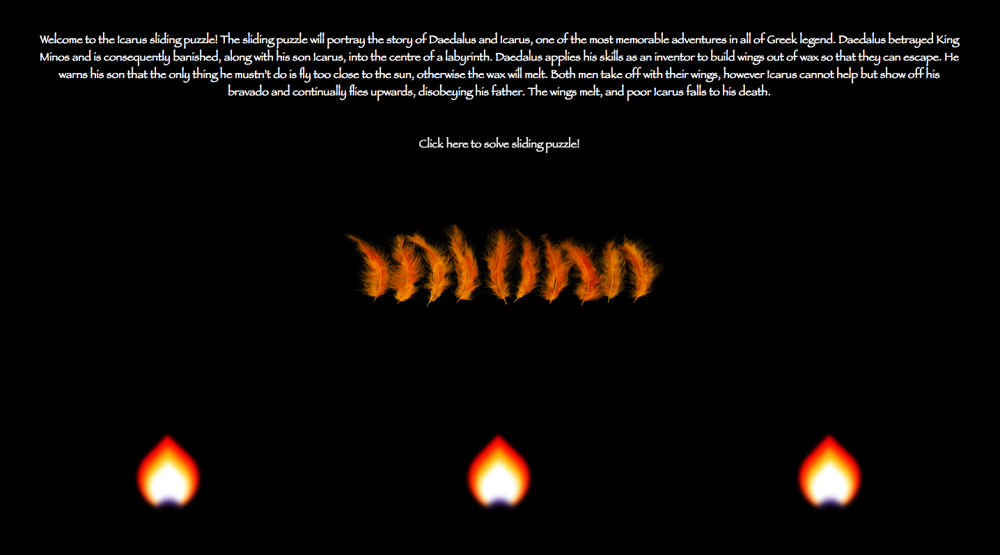
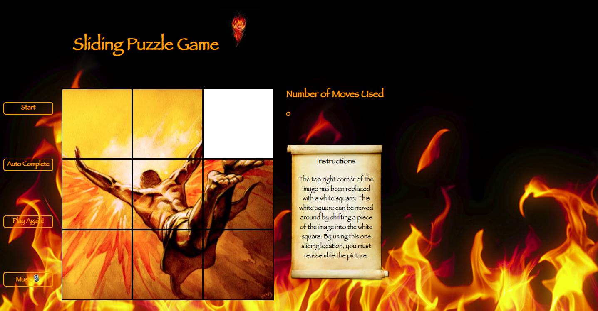
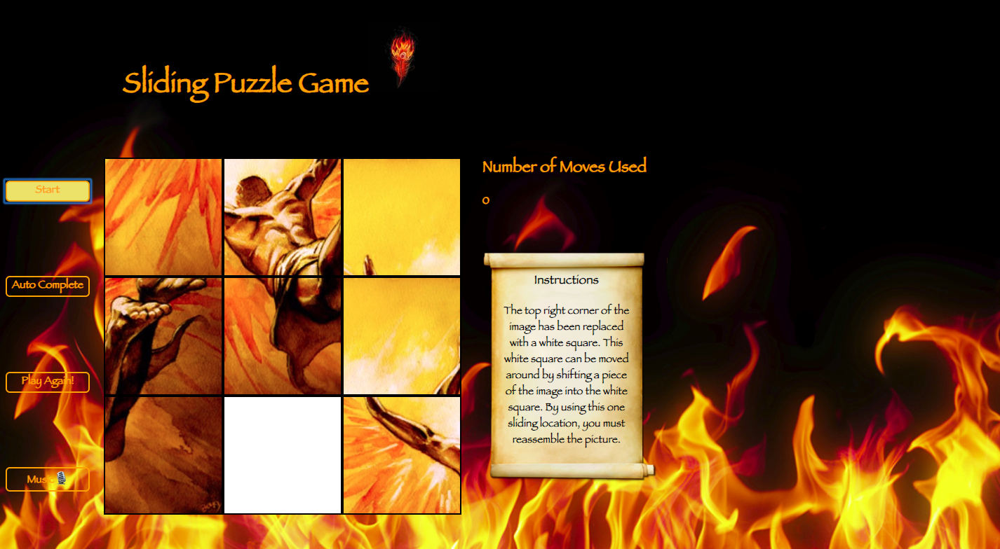

# **Sliding Puzzle Game** 

## Background
Having studied Classics at University, this sliding puzzle game is inspired by the famous Greek myth of Daedalus and Icarus.

The aim of the game is to rearrange the pieces of the sliding puzzle to display the painting of Icarus flying too close to the sun.

This sliding puzzle game is my first project from General Assembly's Web Development Immersive. It took place in week 4. It was an individual project which was built in less than a week, and was the first project I had built from start to finish using HTML, CSS and Javascript.

Launch on [GitHub Pages](https://zoebarrington.github.io/wdi-project-one/). Check out the GitHub [Repo](https://github.com/zoebarrington/wdi-project-one).

## Course Curriculum:
### Week 1: Module One   
* HTML
* CSS and Animation
* Sass
* Javascript
* jQuery

*Full course curriculum available at bottom of page*

***

# Brief
* **Render a grid-based game in the browser**
* **Design logic for winning** & **visually display which player won**
* **Include separate HTML / CSS / JavaScript files**
* Use **Javascript or jQuery** for **DOM manipulation**
* **Deploy your game online**, using Github Pages, where the rest of the world can access it
* Use **semantic markup** for HTML and CSS (adhere to best practices)

**Timeframe:** 1 week(October 2018)

# **Screenshots**

## Introductory Page


## Initial Page


## Page After Clicking Start


## Page When Won


## Technologies Used

* HTML5 and HTML5 audio
* CSS3 with animation
* JavaScript(ECMAScript 6)
* Git
* GitHub
* jQuery
* Google Fonts
* PhotoShop

## Featured Piece of Code no.1

```JavaScript
function resetBoxList() {
  boxes.splice(0, 9, ...Array.from(document.querySelector('.grid').childNodes).filter(({tagName}) => tagName === 'DIV'));
}
```
This piece of code resets the boxes of my puzzle into the correct order by creating a function called resetBoxList. Within the function, the splice empties the array and then fills it with 9 elements. The spread operator then adds the array that is created from Array.from (this creates an array from the childNodes) in .grid, but only with the tag name 'div'.


## Featured Piece of Code no.2
```Javascript
function randomizeBoxPositions() {
  const unorderedBoxes = Array.from(boxes);
  let randomizedBoxes = [];

  if(isDemo) {
    randomizedBoxes = [
      unorderedBoxes[2],
      unorderedBoxes[0],
      unorderedBoxes[1],
      unorderedBoxes[3],
      unorderedBoxes[4],
      unorderedBoxes[5],
      unorderedBoxes[6],
      unorderedBoxes[7],
      unorderedBoxes[8]
    ];
  } else {
    for(let i = 0; i < unorderedBoxes.length; i ++) {
      const randomNumber = Math.floor(Math.random() * (1 + unorderedBoxes.length));
      randomizedBoxes.splice(randomNumber, 0, unorderedBoxes[i]);
    }
  }
  randomizedBoxes.forEach(box => parent.appendChild(box));
  resetBoxList();

}
```
This piece of code shows a function I wrote which randomises the box positions of the boxes of the sliding puzzle game. I made my boxes into divs, and put the divs into an array called randomizedBoxes.

## Wins and Blockers
My main blockers were that I over-complicated the code, and spent a little too much time researching and planning, meaning that I had slightly less time to actually write the code.

The wins were that my code works and I learnt an immense amount from the extensive research that I did. By the end of the project, I felt that I really had a firm grasp on what we had learnt in the first three weeks, and also with my ability to learn and research further code on my own.

Due to my planning, I decided it would be better for the boxes to be the divs themselves, rather than just the content within the divs, and this made the rest of my code must easier to execute.


## Future Features
* To include more levels of difficulty, adding more sliding cards to the puzzle as levels increase and with the images getting more complex
* Drier code and more refactoring
***

## Course Curriculum

> **Week 1-3** | Module One  
* HTML5
* CSS3 and CSS Animation
* Sass
* JavaScript
* jQuery

> **Week 4** | Project One

> **Week 5** | Module Two  
* Node.js
* Express.js
* EJS
* MongoDB
* User Authentication  

> **Week 6** | Project Two

> **Week 7-8** | Module Three
* AngularJS
* Token Authentication & Session Authentication
* Third-party APIs
* Mocha and Chai

> **Week 9** | Project Three

> **Week 10-11** | Module Four
* React
* JSX
* ES6

>**Week 12** | Project Four

***
## Contact
### Zoe Barrington  
Email: zlfbarrington@gmail.com

[Porfolio](zoebarrington.com) | [LinkedIn](https://www.linkedin.com/notifications/) | [GitHub](https://github.com/zoebarrington)
