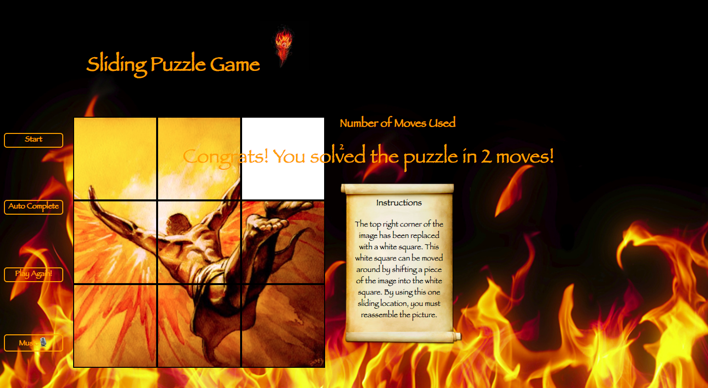

# Sliding Puzzle Game

## Background
This version of a sliding puzzle game is based on the famous Greek myth of Daedalus and Icarus.

This sliding puzzle game is my first project from General Assembly's WeB Development Immersive. It was an individual project which was built in less than a week, and was the first project I had built from start to finish using HTML, CSS and Javascript.


## subtitle
LINK TO [GOOGLE](www.google.com)

## Introductory Page


## Initial Page


## Page After Clicking Start


## Page When Won


## Technologies Used

* HTML5 and HTML5 audio
* CSS3 with animation
* JavaScript(ECMAScript 6)
* Git
* GitHub
* Google Fonts
* PhotoShop

## Featured Piece of Code

```JavaScript
function resetBoxList() {
  boxes.splice(0, 9, ...Array.from(document.querySelector('.grid').childNodes).filter(({tagName}) => tagName === 'DIV'));
}
```
This piece of code resets the boxes of my puzzle into the correct order by creating a function called resetBoxList. Within the function,
